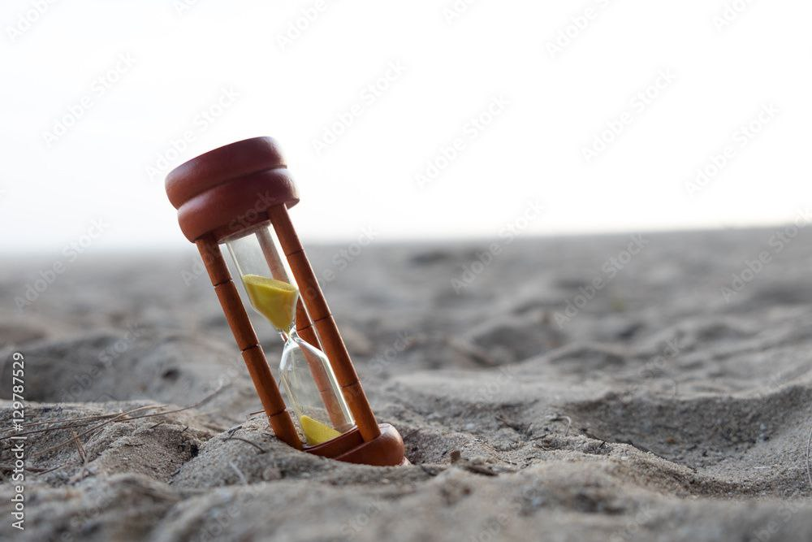
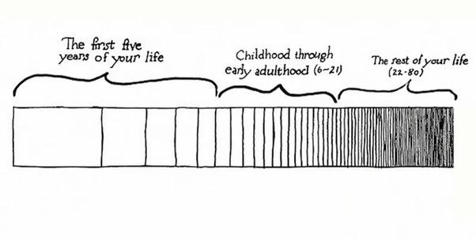

The average life expectancy in Russia is 70 years. Depending on your current age, the time you have left can be shown like this:

| Age | Years left | Months | Weeks | Days  |
|----:|-----------:|-------:|------:|------:|
| 15  | 55         | 660    | 2870  | 20000 |
| 25  | 45         | 540    | 2340  | 16425 |
| 35  | 35         | 420    | 1820  | 12775 |
| 45  | 25         | 300    | 1300  | 9125  |
| 55  | 15         | 180    | 780   | 5475  |
| 65  | 5          | 60     | 260   | 1825  |

That’s fewer than 70 springs, summers, autumns, and winters. That’s fewer than 70 birthdays, New Years, and so on.

### Why time seems to move faster as you age

The longer we live, the more experience we gain, and with experience the sharpness and vividness of external impressions decreases — and it is these impressions that shape our sense of time passing.

Source: https://moika78.ru/news/2022-11-22/829859-pochemu-s-vozrastom-cheloveku-kazhetsya-chto-vremya-nachinaet-idti-bystree/

### Day by day

If we look at one day, then 1/3 of the day (8 hours) goes to sleep.

Do you still want to spend 3–6 hours on your phone out of the remaining 18? Are you sure this is how you want to spend a large part of your life?

The average annual salary worldwide is around ~$10,000. The average working time per year is 2000–2500 hours. That means each hour is worth $4–5. So by spending those same 21 hours on social media per week (or 3 per day), you’re giving $84–105 of your time to companies like Instagram, etc. But in reality, time is worth much more.

If you want to take back control of your time, you need to start now. Write down where you spend your time and think about where you actually want to spend that time. What goals do you have in life?

Write down where your time goes — and decide where you want to spend it instead.

(Translated from russian post)
